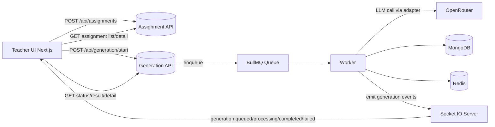
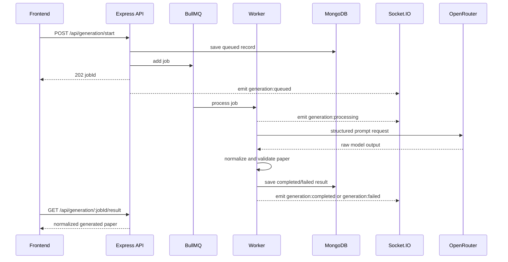

# Veda AI Assessment Creator

A full-stack AI Assessment Creator built from the assignment brief in [vedaai_assessment_.md](vedaai_assessment_.md).

This project enables a teacher workflow end to end:
- Create an assignment with due date, question mix, marks, and optional instructions/file.
- Queue AI generation in the backend.
- Track generation in real time through WebSocket events.
- Persist assignment and generated paper in MongoDB.
- View generated output in a clean, mobile-responsive UI.

## 1. Assessment Coverage

### Implemented core requirements
- Assignment Creation UI with validation.
- Zustand state for assignment draft and generation submit data.
- Structured generation request payload before calling AI.
- Backend with Node.js + Express + TypeScript.
- MongoDB persistence for assignments and generation records.
- Redis + BullMQ queue and worker processing.
- WebSocket subscription model for real-time status updates.
- Output page with sectioned question paper, marks, and difficulty.

### Implemented bonus items
- Regenerate endpoint on backend.
- Difficulty badges in output UI.
- Download capability currently provided as JSON export from assignment detail page.

### Notes
- Bonus target says download as PDF. Current implementation exports generated paper JSON. PDF export can be added as an enhancement.

## 2. Tech Stack

### Frontend
- Next.js (App Router)
- TypeScript
- Zustand
- React Hook Form + Zod
- Socket.IO Client
- Tailwind CSS
- Clerk (authentication)

### Backend
- Node.js + Express + TypeScript
- MongoDB + Mongoose
- Redis + BullMQ
- Socket.IO
- Zod
- Clerk backend auth verification

### AI provider
- OpenRouter (configurable model via environment variables)

## 3. System Architecture



## 4. Generation Lifecycle



## 5. Repository Structure

- [backend](backend)
- [backend/src/app.ts](backend/src/app.ts)
- [backend/src/routes/assignment.route.ts](backend/src/routes/assignment.route.ts)
- [backend/src/routes/generation.route.ts](backend/src/routes/generation.route.ts)
- [backend/src/modules/assignments](backend/src/modules/assignments)
- [backend/src/modules/generation](backend/src/modules/generation)
- [backend/src/queue](backend/src/queue)
- [backend/src/sockets/socket.server.ts](backend/src/sockets/socket.server.ts)
- [veda-frontend](veda-frontend)
- [veda-frontend/app/(dashboard)/assignments/page.tsx](veda-frontend/app/(dashboard)/assignments/page.tsx)
- [veda-frontend/app/(dashboard)/assignments/new/page.tsx](veda-frontend/app/(dashboard)/assignments/new/page.tsx)
- [veda-frontend/app/(dashboard)/assignments/[assignmentId]/page.tsx](veda-frontend/app/(dashboard)/assignments/%5BassignmentId%5D/page.tsx)
- [veda-frontend/app/(dashboard)/ai-toolkit/page.tsx](veda-frontend/app/(dashboard)/ai-toolkit/page.tsx)
- [veda-frontend/src/store](veda-frontend/src/store)
- [veda-frontend/src/hooks/use-generation-status-socket.ts](veda-frontend/src/hooks/use-generation-status-socket.ts)

## 6. API Specification

### Assignment APIs
- POST /api/assignments
  - Creates or updates assignment metadata.
- GET /api/assignments
  - Returns assignment list for the authenticated user.
- GET /api/assignments/:assignmentId
  - Returns assignment detail + latest generation snapshot + latest generated paper.
- DELETE /api/assignments/:assignmentId
  - Deletes assignment and related generation history.

### Generation APIs
- POST /api/generation/start
  - Accepts multipart/form-data (optional file) and generation payload.
  - Enqueues job and returns job id.
- POST /api/generation/:jobId/regenerate
  - Re-runs generation for a job context.
- GET /api/generation/:jobId
  - Returns job status/progress.
- GET /api/generation/:jobId/result
  - Returns normalized generated paper on completion.

### Health APIs
- GET /api/health
- GET /api/health/diagnostics

## 7. WebSocket Contract

Server events emitted to frontend:
- generation:queued
- generation:processing
- generation:completed
- generation:failed

Client subscription actions:
- generation:subscribe with assignmentId
- generation:unsubscribe with assignmentId

Socket room pattern:
- assignment:{assignmentId}

## 8. Data Contracts

### Assignment payload (frontend to backend)
- assignmentId: string
- title: string
- dueDate: string
- questionTypes: array of
  - type
  - numberOfQuestions
  - marksPerQuestion
  - totalMarks
- totalQuestions: number
- totalMarks: number
- additionalInstructions: optional string
- sourceFileAttached: boolean

### Generated paper shape
- assignmentId
- schoolName
- subject
- className
- timeAllowedMinutes
- maxMarks
- studentFields
  - name
  - rollNumber
  - section
- sections[]
  - id
  - title
  - instruction
  - questions[]
    - id
    - text
    - marks
    - difficulty (easy, medium, hard)
- answerKey[] optional

## 9. Validation Rules

Frontend form validation:
- Due date required.
- At least one question type row.
- numberOfQuestions >= 1.
- marksPerQuestion >= 1.
- Optional file must be PDF.
- File size max 10 MB.
- additionalInstructions max length constraints via schema.

Backend validation:
- Assignment create payload validated with Zod.
- Generation payload normalization and guard rails before persistence.
- Unknown/invalid structures rejected with consistent API error envelopes.

## 10. Authentication

- Frontend uses Clerk for user session.
- Backend validates auth and resolves user identity per request.
- Data access is user-scoped for assignments and generation records.

## 11. Environment Variables

### Backend env
Defined in [backend/src/config/env.ts](backend/src/config/env.ts):
- PORT default 4000
- CORS_ORIGIN default http://localhost:3000
- MONGO_URI
- REDIS_URL
- CLERK_SECRET_KEY
- OPENROUTER_API_KEY
- OPENROUTER_MODEL default openai/gpt-4o-mini

### Frontend env
Defined in [veda-frontend/src/lib/env.ts](veda-frontend/src/lib/env.ts):
- NEXT_PUBLIC_API_URL default http://localhost:4000/api
- NEXT_PUBLIC_SOCKET_URL default http://localhost:4000

## 12. Local Setup

### Prerequisites
- Node.js 18+
- MongoDB
- Redis
- Clerk project and keys
- OpenRouter API key

### Install
From project root:

```bash
cd backend && npm install
cd ../veda-frontend && npm install
```

### Run backend

```bash
cd backend
npm run dev
```

Expected service:
- API at http://localhost:4000/api

### Run frontend

```bash
cd veda-frontend
npm run dev
```

Expected service:
- App at http://localhost:3000

If startup fails because ports are already in use, free ports 3000 and 4000 before restarting.

## 13. User Workflow

1. Open assignments dashboard.
2. Create new assignment.
3. Save draft and trigger generation.
4. UI subscribes to generation room via WebSocket.
5. Watch queued to processing to completed status updates.
6. Open detail/output page to view generated paper.
7. Download generated paper JSON or regenerate.
8. Delete assignment when needed.

## 14. Current Status and Next Improvements

### Stable
- Assignment create/list/detail/delete flow wired end to end.
- Queue-driven generation and real-time status updates.
- Persisted output retrieval from backend.

### Suggested improvements
- Implement true PDF export for generated paper.
- Add server-side pagination for assignment lists.
- Add optimistic retry UI for transient generation failures.
- Add integration tests for queue-worker and API contracts.

## 15. Assessment Mapping Checklist

- Assignment creation form with validation: Done
- Zustand state management: Done
- WebSocket management: Done
- Structured prompt to AI and parsed output: Done
- Avoid direct raw LLM rendering: Done
- MongoDB persistence: Done
- Redis + BullMQ async processing: Done
- Realtime updates via sockets: Done
- Output page with student info and sections: Done
- Clean and responsive UI: Done
- Bonus regenerate: Done
- Bonus difficulty badges: Done
- Bonus PDF download: Partial (JSON export implemented)
