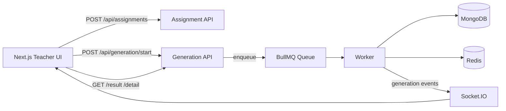

# Veda AI Assessment Creator

Production-ready full-stack implementation of the assessment brief in [vedaai_assessment_.md](vedaai_assessment_.md).

## What this project does

Teacher workflow end-to-end:
- Create assignments with due date, question mix, marks, optional instructions, and optional source file upload (PDF or TXT).
- Start AI generation via backend queue jobs.
- Track generation in real time using Socket.IO events.
- Persist assignments and generated papers in MongoDB.
- View generated paper in clean desktop/mobile layouts.
- Regenerate paper and download output (JSON export + print-to-PDF view).

## Tech stack

Frontend:
- Next.js (App Router) + TypeScript
- Zustand
- React Hook Form + Zod
- Tailwind CSS
- Socket.IO Client
- Clerk auth

Backend:
- Node.js + Express + TypeScript
- MongoDB + Mongoose
- Redis + BullMQ
- Socket.IO
- Zod

AI layer:
- Adapter architecture in [backend/src/modules/generation/ai-adapter.ts](backend/src/modules/generation/ai-adapter.ts)
- OpenRouter-ready prompt flow with deterministic fallback generation

## Architecture overview



## Feature coverage

### Core features from assessment

1. Assignment creation frontend:
- Done: due date, question rows, marks, additional instructions.
- Done: optional file upload.
- Done: validation for required and non-negative/non-zero values.
- Done: state management via Zustand.
- Done: WebSocket status management.

2. AI question generation:
- Done: request is converted into structured payload and prompt.
- Done: output normalized into section/question/difficulty/marks model.
- Done: raw LLM response is not rendered directly.

3. Backend system:
- Done: Express + TypeScript.
- Done: MongoDB for assignments and generation results.
- Done: Redis + BullMQ queue + worker.
- Done: WebSocket notifications for queued/processing/completed/failed.

4. Output page:
- Done: student info fields in paper model and paper sheet view.
- Done: section title, instruction, question list.
- Done: difficulty and marks per question.
- Done: clean responsive rendering.

### Bonus features

- Regenerate paper: done.
- Difficulty badges: done.
- Download as PDF: partial.
  - Currently supported:
    - JSON download from assignment detail page.
    - Print-friendly paper rendering that can be saved as PDF from browser print dialog.
  - Not yet implemented: dedicated server/client PDF binary export endpoint.

## Extra features added beyond brief

- Home dashboard journey sections and improved visual shell.
- Assignment page polish and responsive controls.
- AI toolkit progress bar and regenerate-first flow.
- Profile page complete redesign:
  - Desktop and mobile-specific layouts.
  - Persisted profile form (name, class, subject, school details).
  - Email auto-bound to logged-in session.
  - Hover interactions and visual polish for avatar/logo.
  - Independent Home button behavior for desktop/mobile.
- Desktop shell improvements:
  - Navbar displays first name only from saved profile.
  - School name box shown above Settings in desktop sidebar.

## Key backend routes

Assignments:
- POST /api/assignments
- GET /api/assignments
- GET /api/assignments/:assignmentId
- PATCH /api/assignments/:assignmentId/rename
- DELETE /api/assignments/:assignmentId

Generation:
- POST /api/generation/start
- POST /api/generation/:jobId/regenerate
- GET /api/generation/:jobId
- GET /api/generation/:jobId/result

Health:
- GET /api/health
- GET /api/health/diagnostics

## WebSocket contract

Events emitted:
- generation:queued
- generation:processing
- generation:completed
- generation:failed

Client actions:
- generation:subscribe { assignmentId }
- generation:unsubscribe { assignmentId }

Room convention:
- assignment:{assignmentId}

## Data and persistence notes

- Assignment and generation data persist in MongoDB.
- Queue/job state and worker operations use Redis/BullMQ.
- Profile values persist in frontend Zustand store (local persistence), including:
  - userName
  - className
  - teacherSubject
  - schoolName
  - schoolLocation
  - schoolIconUrl

## File upload support

Frontend validation in [veda-frontend/src/modules/assignments/schema.ts](veda-frontend/src/modules/assignments/schema.ts):
- PDF and TXT supported.
- Max file size 10MB.

Backend extraction in [backend/src/modules/generation/file-extractor.ts](backend/src/modules/generation/file-extractor.ts):
- PDF text extraction.
- TXT plain text extraction.

## Environment variables

Backend ([backend/src/config/env.ts](backend/src/config/env.ts)):
- PORT
- CORS_ORIGIN
- MONGO_URI
- REDIS_URL
- CLERK_SECRET_KEY
- OPENROUTER_API_KEY
- OPENROUTER_MODEL

Frontend ([veda-frontend/src/lib/env.ts](veda-frontend/src/lib/env.ts)):
- NEXT_PUBLIC_API_URL
- NEXT_PUBLIC_SOCKET_URL

## Local development

Prerequisites:
- Node.js 18+
- MongoDB
- Redis
- Clerk keys
- OpenRouter key (if using provider mode)

Install:

```bash
cd backend && npm install
cd ../veda-frontend && npm install
```

Run backend:

```bash
cd backend
npm run dev
```

Run frontend:

```bash
cd veda-frontend
npm run dev
```

Quality checks:

```bash
cd veda-frontend && npm run lint
cd ../backend && npm run build
```

## Deployment notes

- Deploy backend and frontend separately with consistent env values.
- Set CORS origin(s) for frontend host(s).
- Ensure Redis and Mongo are reachable from backend runtime.
- Validate Clerk and OpenRouter secrets in production.

## Assessment checklist summary

- Assignment form and validation: complete
- Zustand + WebSocket management: complete
- Structured AI generation flow: complete
- Node/Express + Mongo + Redis + BullMQ + Socket updates: complete
- Output rendering with sections/difficulty/marks: complete
- Bonus regenerate: complete
- Bonus difficulty badges: complete
- Bonus PDF export endpoint: partial (print-to-PDF and JSON download available)
